# **Modeling and Analyzing a Lithium-Ion Battery Charging Profile**
### Group 9 Internship Project
#### Description:

This MATLAB project models and analyzes the charging behavior of a lithium-ion battery cell using real cycling data from MathWorks' single-cell battery aging dataset. It fits the data to circuit-based models, then uses numerical differentiation and integration to quantify charge time, energy delivered, resistive energy loss, and the rate of voltage change — including separating and characterizing the constant-current (CC) and constant-voltage (CV) charging regions — for Cycle 1 of the recorded data.

---
### Methods

The battery's charging voltage is first approximated with the classic single-exponential RC charging equation:

`V(t) = Vmax * (1 - exp(-t / RC))`

Real measurements (current, voltage, time) are loaded from `singleCellLifeTimeData.mat`, parsed and segmented into charge/discharge phases with the Predictive Maintenance Toolbox's `batteryTestDataParser`, then used to:

- **Fit the RC model**: Use the Curve Fitting Toolbox (`fit`) to estimate the time constant `tau = R * C` against a fixed Vmax of 3.6 V across the entire charge.
- **Compute charge time**: Find the elapsed time to reach 80% and 100% of Vmax.
- **Analyze rate of voltage change**: Use `gradient` to compute dV/dt at the 50%, 80%, and 100% charge points and flag direction-change transitions (e.g., between current steps and the CC → CV taper).
- **Compute total energy delivered**: Integrate power (`P = I * V`) over time with `trapz` to get energy in joules and watt-hours.
- **Estimate resistive energy loss**: Integrate `P_loss = I^2 * R` (using the dataset's internal resistance measurements) over time to quantify heat losses.
- **Visualize voltage, current, and power**: Plot all three vs. time as synchronized subplots for one charging cycle.
- **Separate CC and CV regions**: Detect the CC→CV transition as the point where voltage first reaches 99.5% of its peak, confirmed against where dV/dt flattens near 0.
- **Fit CC and CV regions independently**: Fit the CC-region voltage to an exponential rise and the CV-region current to an exponential decay `I(t) = I0 * exp(-t/tau_cv)`, each with its own time constant.
- **Compare energy by phase**: Integrate power separately over the CC and CV regions to see how charging energy is distributed between the two phases.

---

### Folder Structure

#### `/data_analysis_code/`
MATLAB Live Scripts performing the core analysis, each loading and segmenting the cycle-1 charging data before running its analysis:

- [`fitting_RCeq.mlx`](data_analysis_code/fitting_RCeq.mlx): Fits a single-exponential RC charging equation to the entire measured voltage curve and reports the fitted time constant and goodness-of-fit statistics (R², RMSE, SSE).
- [`charge_time.mlx`](data_analysis_code/charge_time.mlx): Calculates the time required to reach 80% and 100% state of charge.
- [`rate_change_analysis.mlx`](data_analysis_code/rate_change_analysis.mlx): Computes dV/dt across the charging window and summarizes the rate of voltage change at the 50%, 80%, and 100% charge points, flagging direction-change transitions.
- [`total_energy_delivered.mlx`](data_analysis_code/total_energy_delivered.mlx): Integrates power over time to compute total energy delivered to the battery (J and Wh).
- [`resistive_energy_loss.mlx`](data_analysis_code/resistive_energy_loss.mlx): Integrates I²R power loss over time to estimate total resistive energy loss (J and Wh).
- [`vIp_vs_t_eq.mlx`](data_analysis_code/vIp_vs_t_eq.mlx): Plots voltage, current, and power vs. time as three subplots for one charging cycle.
- [`CC_CV_region.mlx`](data_analysis_code/CC_CV_region.mlx): Detects the CC→CV transition point and plots a dual-axis voltage/current profile with the CC and CV regions shaded.
- [`fitting_CC_CV.mlx`](data_analysis_code/fitting_CC_CV.mlx): Independently fits the CC region (voltage, exponential rise) and CV region (current, exponential decay), reporting each fit's time constant and goodness-of-fit.
- [`energy_distribution_byPhase.mlx`](data_analysis_code/energy_distribution_byPhase.mlx): Integrates power separately across the CC and CV regions to report energy delivered and its percentage split between phases.

#### `/Media/`
PNG figures exported from the Live Scripts above, used for the analysis report below.

#### `/battery_dataset/`
Contains the raw dataset and the scripts used to download, load, and parse it:

- [`data_extraction.mlx`](battery_dataset/data_extraction.mlx): Downloads the MathWorks single-cell battery aging dataset, loads it, and demonstrates parsing/segmenting it with `batteryTestDataParser`.
- [`hPlotRawMeasurementsWithSegments.m`](battery_dataset/hPlotRawMeasurementsWithSegments.m): Helper function that plots raw voltage and current for a given cycle, colored by cycling mode/segment.
- `singleCellLifeTimeData.mat`: The battery cycling dataset (voltage, current, temperature, cycle/step index, and derived internal resistance for a single lithium-ion cell cycled to 80% state of health under fast-charging conditions).
- `license.txt`: License (CC BY 4.0) for the dataset, provided by MathWorks.
- `Examples/R2026a/supportfiles/predmaint/batteryagingdata/singlecell/v1/singleCellLifeTimeData.zip`: Cached copy of the dataset archive downloaded by MATLAB's `matlab.internal.examples.downloadSupportFile`.

#### Root files
- [`singleCellLifeTimeData.mat`](singleCellLifeTimeData.mat): Copy of the dataset used by the analysis scripts.
- [`license.txt`](license.txt): CC BY 4.0 license text for the dataset.
- [`LICENSE`](LICENSE): MIT license covering this project's code.

---

### How to Run
You can run any `.mlx` Live Script directly in MATLAB:
1. Clone this repository to your local machine.
2. Ensure MATLAB is installed with the **Predictive Maintenance Toolbox** (for `batteryTestDataParser`) and the **Curve Fitting Toolbox** (for `fitting_RCeq.mlx` and `fitting_CC_CV.mlx`).
3. Open a script from [`/data_analysis_code/`](data_analysis_code) in MATLAB — each script downloads/loads the dataset itself via `matlab.internal.examples.downloadSupportFile`, so no manual setup is required.
4. Click **Run All Sections**, or run sections interactively one-by-one to inspect intermediate results and plots.

To inspect the raw dataset directly, open [`data_extraction.mlx`](battery_dataset/data_extraction.mlx) first.

---

## Charging Profile Analysis Report (Cycle 1)

All results below are computed from Cycle 1 of the single lithium-ion cell in `singleCellLifeTimeData.mat`, which uses a multi-step fast-charging policy rather than a simple, single-rate constant current: the raw current trace steps down from **~6.6 A → ~4.0 A → ~1.1 A** before tapering off in a constant-voltage (CV) hold. This stair-step behavior is visible directly in the raw measurements below and explains several of the fitting results that follow.

### Raw Voltage, Current, and Power Profile
[`vIp_vs_t_eq.mlx`](data_analysis_code/vIp_vs_t_eq.mlx) plots the three key electrical quantities together for the full charging cycle.

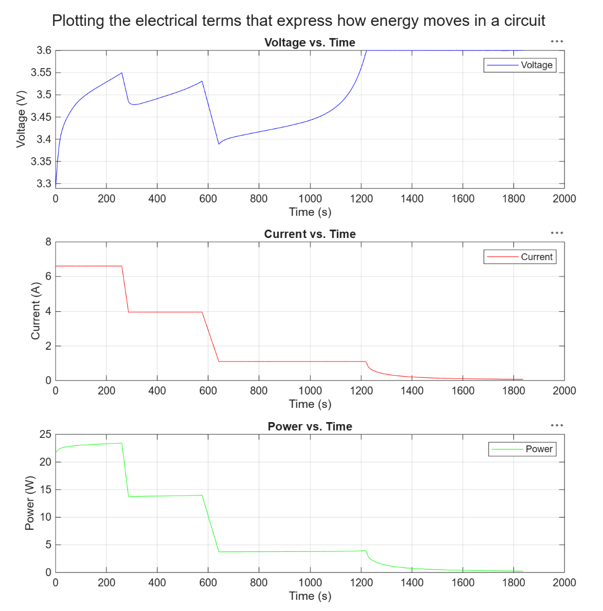

Each current step-down causes a visible voltage sag followed by a re-rise (seen as the saw-tooth pattern between ~250s and ~650s), since voltage momentarily drops when internal-resistance ohmic drop decreases at each lower current step. Power (P = I·V) tracks the current staircase closely, peaking near **23.4 W** early in the charge and decaying toward 0 W as current tapers during the CV hold.

### Time to 80% and 100% Charge
[`charge_time.mlx`](data_analysis_code/charge_time.mlx) locates the first timestamps at which voltage crosses the 80%- and 100%-of-range thresholds (using Vmax = 3.6 V, Vmin = 2.0 V).

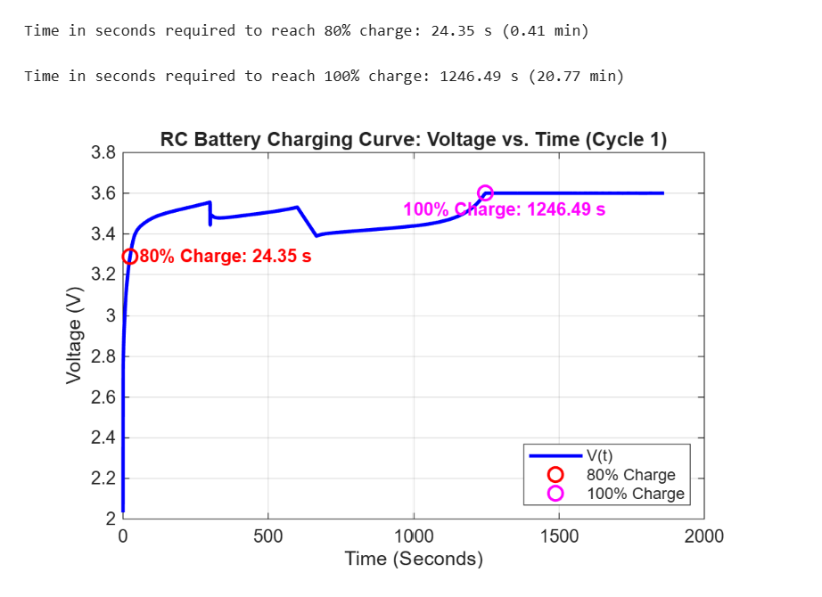

| Charge Level | Time |
| --- | --- |
| 80% charge | **24.35 s** (0.41 min) |
| 100% charge | **1246.49 s** (20.77 min) |

The 80% mark is reached almost immediately (under 25 seconds) because the cell starts deeply discharged near 2.0 V and the initial current step drives a steep voltage rise; the remaining climb from 80% to 100% — the CV taper — takes over 20 minutes on its own, more than 98% of the total charge time.

### Rate of Voltage Change (dV/dt)
[`rate_change_analysis.mlx`](data_analysis_code/rate_change_analysis.mlx) computes the numerical derivative of voltage with respect to time and reports it at the 50%, 80%, and 100% charge points, along with points where the slope changes direction (the current-step transitions).

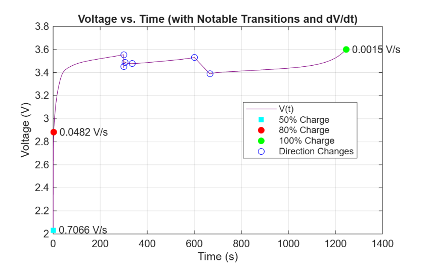
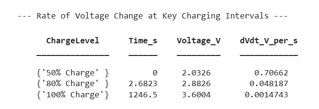

| Charge Level | Time (s) | Voltage (V) | dV/dt (V/s) |
| --- | --- | --- | --- |
| 50% | 0 | 2.0326 | 0.70662 |
| 80% | 2.68 | 2.8826 | 0.048187 |
| 100% | 1246.5 | 3.6004 | 0.0014743 |

dV/dt drops by nearly **3 orders of magnitude** from the start of charge to full charge (0.707 V/s → 0.0015 V/s), confirming the charging profile spends its early seconds in a fast, steep-voltage-rise regime, then flattens out almost completely during the long CV taper.

### RC-Circuit (Single-Exponential) Fit
[`fitting_RCeq.mlx`](data_analysis_code/fitting_RCeq.mlx) first illustrates the idealized RC charging equation with example parameters (Vmax = 3.6 V, R = 10 Ω, C = 10 F) before fitting it against the real measured data.

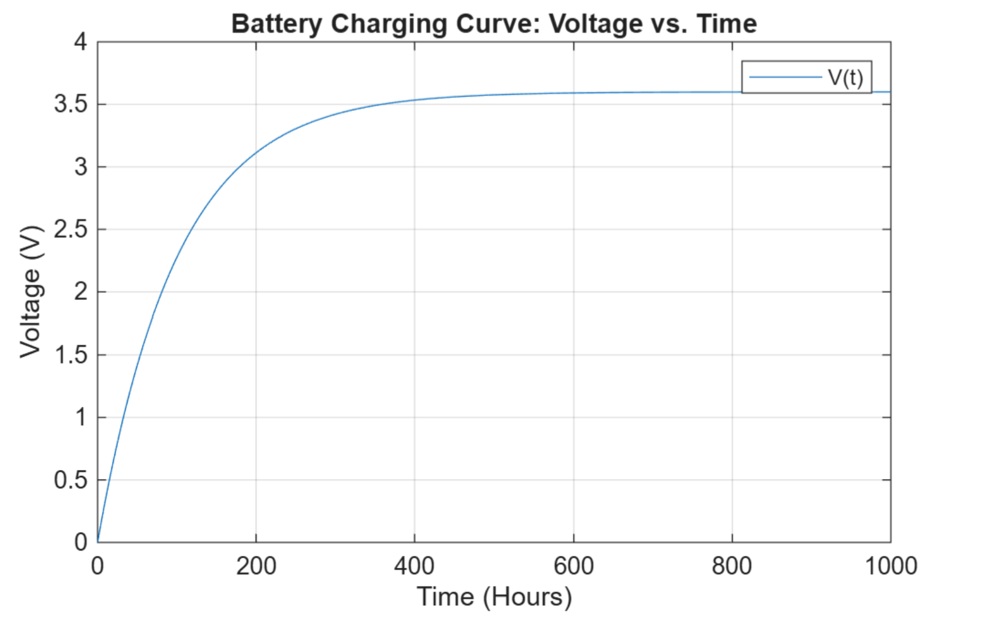

It then attempts to fit the *entire* real charging curve to a single classic RC exponential, `V(t) = 3.6 * (1 - exp(-t/tau))`.

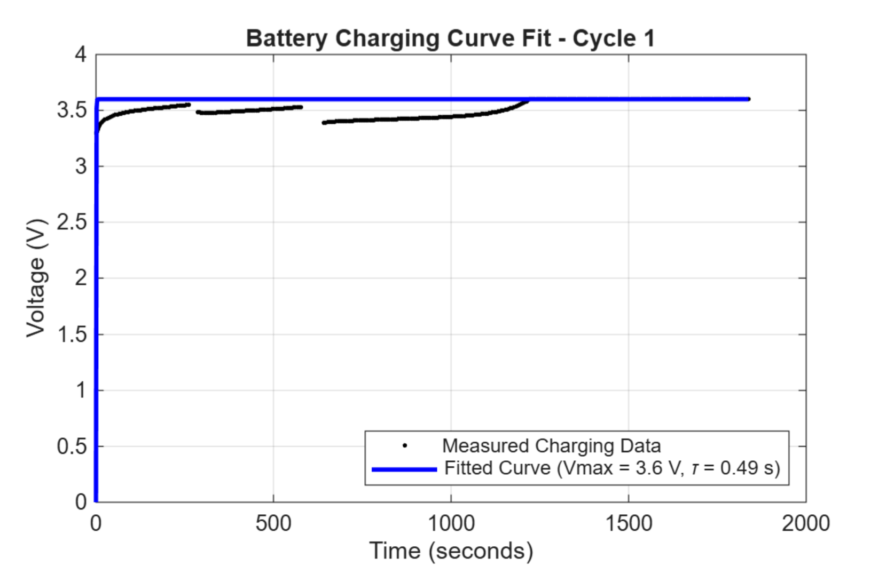
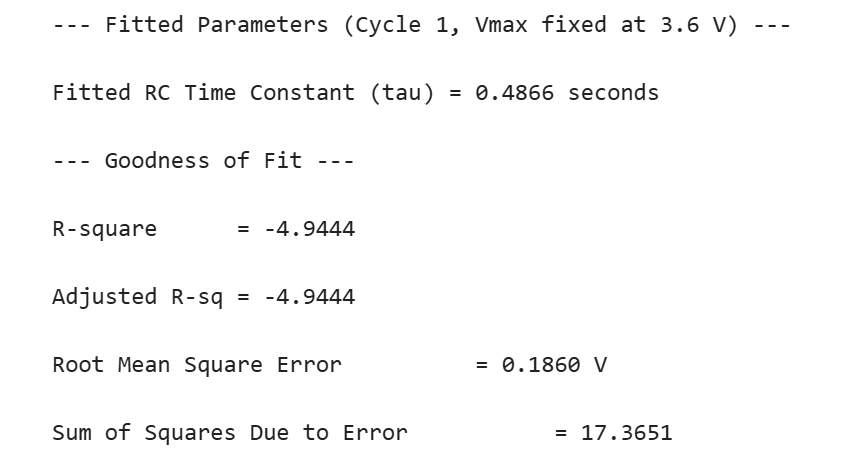

| Metric | Value |
| --- | --- |
| Fitted tau | 0.4866 s |
| R² | **-4.9444** |
| RMSE | 0.1860 V |
| SSE | 17.3651 |

A negative R² means this single-exponential model fits the real data **worse than a flat horizontal line would** — it is not an appropriate model for the whole cycle. This is expected: the measured curve isn't one smooth exponential rise, it's a multi-step staircase (visible in the plot as repeated sawtooth dips), so a single time constant cannot capture the current step-downs partway through the charge.

### CC/CV Region Separation
[`CC_CV_region.mlx`](data_analysis_code/CC_CV_region.mlx) programmatically locates the CC→CV boundary as the first point where voltage reaches 99.5% of its peak, cross-checked against where dV/dt flattens toward 0.

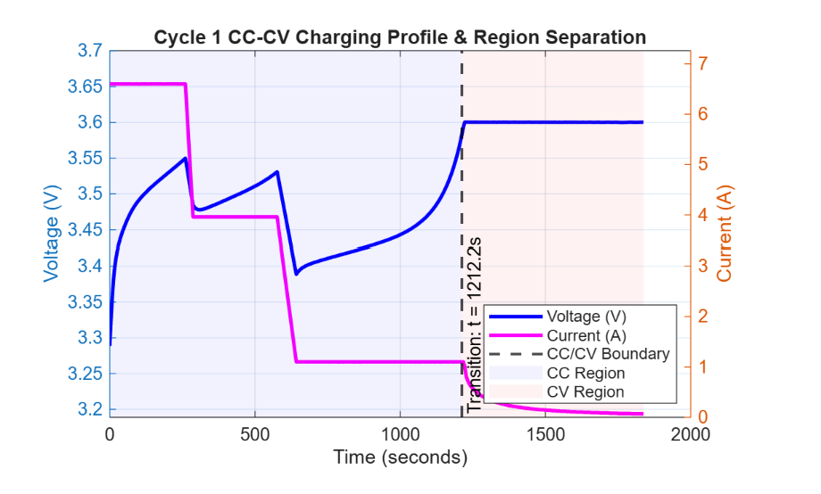
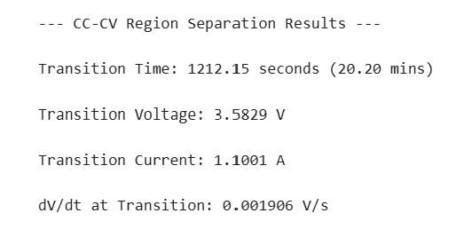
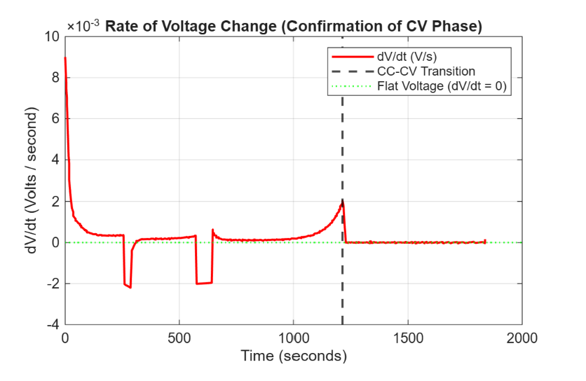

| Metric | Value |
| --- | --- |
| Transition time | 1212.15 s (20.20 min) |
| Transition voltage | 3.5829 V |
| Transition current | 1.1001 A |
| dV/dt at transition | 0.001906 V/s |

The identified boundary lines up with the final, lowest current step in the raw profile (~1.1 A), confirming that the cell effectively behaves as constant-current up to ~20.2 minutes, then switches to a voltage-holding taper for roughly the remaining ~630 seconds (~10.5 min) of measured charging — about a third of the total ~30.7-minute cycle.

### Independent CC and CV Fits
Because a single exponential fit poorly over the whole cycle, [`fitting_CC_CV.mlx`](data_analysis_code/fitting_CC_CV.mlx) fits each region separately: the CC-region voltage to an exponential rise, and the CV-region current to an exponential decay `I(t) = I0 * exp(-t/tau_cv)`.

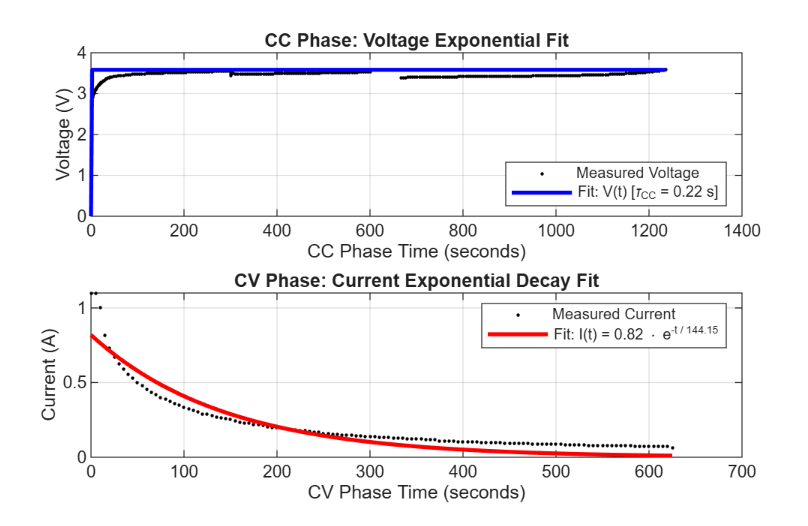
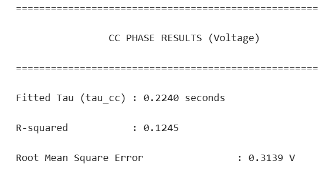
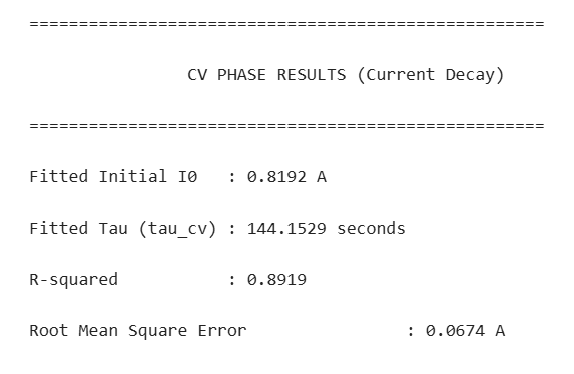

| Phase | Fitted Parameters | R² | RMSE |
| --- | --- | --- | --- |
| CC (voltage rise) | tau_cc = 0.2240 s | 0.1245 | 0.3139 V |
| CV (current decay) | I0 = 0.8192 A, tau_cv = 144.15 s | **0.8919** | 0.0674 A |

Splitting the fit helps, but the CC-region voltage fit is still poor (R² = 0.12) because that region isn't truly constant-current — it contains the three separate current steps described above, so no single exponential curve fits it well either. The CV-region current decay, in contrast, is a genuinely clean single exponential and fits much better (R² = 0.89), confirming that only the final taper segment behaves like an ideal CV hold.

### Total Energy Delivered
[`total_energy_delivered.mlx`](data_analysis_code/total_energy_delivered.mlx) integrates instantaneous power (P = I·V) over the full charge using the trapezoidal rule.

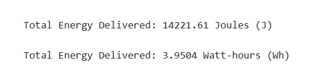

| Metric | Value |
| --- | --- |
| Total energy delivered | **14221.61 J** (3.9504 Wh) |

### Resistive (I²R) Energy Loss
[`resistive_energy_loss.mlx`](data_analysis_code/resistive_energy_loss.mlx) integrates `P_loss = I² * R` over the charge, using the dataset's measured internal resistance.

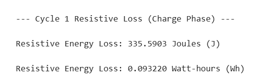

| Metric | Value |
| --- | --- |
| Resistive energy loss | **335.59 J** (0.09322 Wh) |
| Loss as % of total energy delivered | ≈ **2.36%** |

Only about 2.4% of the energy delivered to the cell is dissipated as resistive heat during Cycle 1 — the charging process is highly efficient at this point in the cell's life, consistent with a fresh/early cycle rather than an aged cell with higher internal resistance.

### Energy Distribution by Phase (CC vs. CV)
[`energy_distribution_byPhase.mlx`](data_analysis_code/energy_distribution_byPhase.mlx) integrates power separately over the CC and CV regions identified above to see how the delivered energy splits between the two phases.

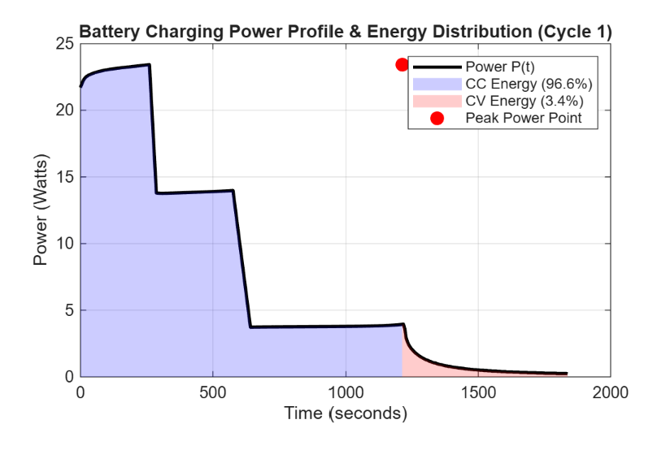
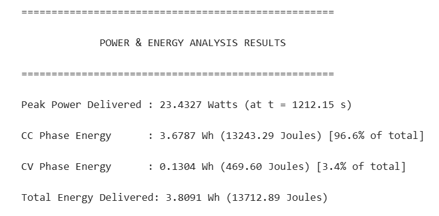

| Phase | Energy | % of Total |
| --- | --- | --- |
| CC region | 13243.29 J (3.6787 Wh) | **96.6%** |
| CV region | 469.60 J (0.1304 Wh) | **3.4%** |
| **Total** | **13712.89 J (3.8091 Wh)** | 100% |
| Peak power | 23.4327 W at t = 1212.15 s | — |

Even though the CV taper occupies roughly a third of the total charging time (~630 s of ~1842 s), it contributes only **3.4%** of the total energy, since power scales with current and current is far lower during the CV taper than during the CC steps. The CC region (the multi-step high-current portion) delivers the overwhelming majority of the charge energy, **96.6%**, in about two-thirds of the time. The CV phase exists mainly to safely top off the last few percent of charge without exceeding Vmax, at the cost of disproportionately more time for very little added energy.

> **Note:** The total energy figure here (13712.89 J) is slightly lower than the 14221.61 J reported by `total_energy_delivered.mlx` because this script filters for `IsValid` data points, excluding a small number of flagged/anomalous samples that the unfiltered script includes.

---

###  Contributors

Based on the repository's commit history:

- **miyokokasey**
- **AngeloB06**
- **viviingn**
- **Asher Vicera**

---

###  References:
- [MathWorks Predictive Maintenance Toolbox — Battery Aging Dataset](https://www.mathworks.com/help/predmaint/) — source of `singleCellLifeTimeData.mat`, licensed under CC BY 4.0.
- [MATLAB Curve Fitting Toolbox Documentation](https://www.mathworks.com/help/curvefit/)
- [MATLAB Onramp](https://matlabacademy.mathworks.com/details/matlab-onramp/gettingstarted)

---
